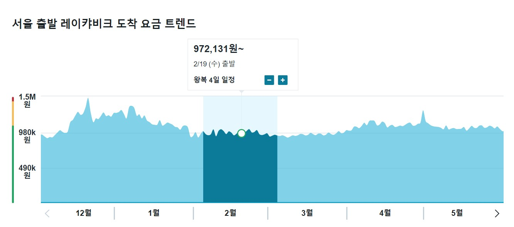

# 웹 크롤링 주제 : 항공권 가격 추적
### 배경

- 데이터사이언스 과정이 끝나면 아이슬란드에 오로라를 보러 가볼까
- 출발일(예 2020년 2월 19일)이 같더라도 언제 예매하느냐에 따라 항공권 가격은 변함
- 항공권 가격비교사이트의 요금 트렌트 분석은 오늘(예 2019년 12월 3일) 예매할 때를 기준이므로,
- 시간변화에 따라 출발일의 '최적 항공권' 가격이 어떻게 변화하는지 추적한다.

### 방법
- 하루 한 번 가격과 예매처 정보를 불러들여서 Database나 구글스프레드시트에 저장
